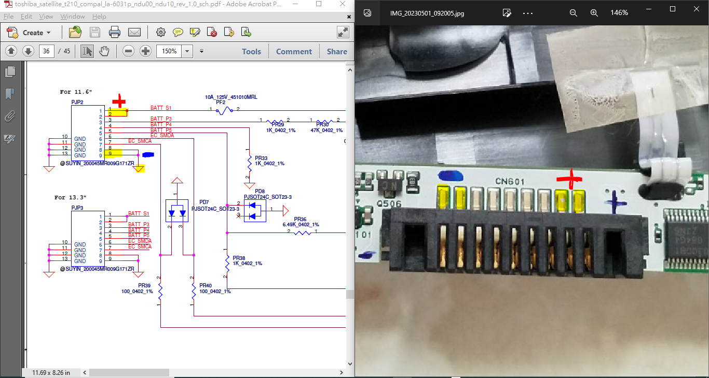

# SmartBatteryHack_Toshiba_Portage_T210

battery pack was dead hard after 4 years used since yesr 2011, battery cells had removed, housing of  battery pack retianed more than 10 years with reason that retained as support and base for the notebook but the battery will never service or charging again.

Today year 2023 the price to replace a T210 battery pack is about 100RMB less by Taobao/Aliexpress, so why would do a hack or try to renew the cells ?! FOR FUN and to learn to how.

### ref and fork 
https://boundarycondition.home.blog/2020/01/18/the-repairing-and-hacking-of-a-dell-j1knd-bq8050-laptop-battery/  
https://github.com/xiaolaba/SmartBatteryHack  

### the last activiy about Smart Battery  
https://github.com/xiaolaba/ATmega406-SPHDV20

### find pinout of Toshiba_T210_battery_PA3820U  
this is data sheet and the hints  

  
  

### download source code from the forked repo  
https://github.com/xiaolaba/SmartBatteryHack


### arduino code modification, I have Nano with Atmega168P only
add support and code altered, same pinout for 168/328 and thus the Nano hardware pinput of Nano.
```
// xiaolaba, 2023-04-30, add 168P support
// name:     SCL  SDA
// port pin: PC5  PC4
// pin#:     28   27    // DIP28/TQFP32/QFN32,  Atmega168P/328P, 
//           24   23    // QFN28
//           D19  D18   // Arduino Nano
//           A5   A4    // Arduino Nano 
#elif defined (__AVR_ATmega168P__) || defined (__AVR_ATmega168__) // Arduino Nano with 168 MCU, hardware I2C pins
    #define SDA_PORT PORTC
    #define SDA_PIN 4
    #define SCL_PORT PORTC
    #define SCL_PIN 5
```

This is SDA/SCL lines,

  
  


### PC software / MCU firmware, precompiled and testing, no battery connection is required  
testing the communication of PC/MCU, ok  


sign the C# PC software for installation and expireation date till 2027  


path of the software release,  
[Firmware_Hostware/PC_software](Firmware_Hostware/PC_software)  
[Firmware_Hostware/MCU_firmware](Firmware_Hostware/MCU_firmware)  
